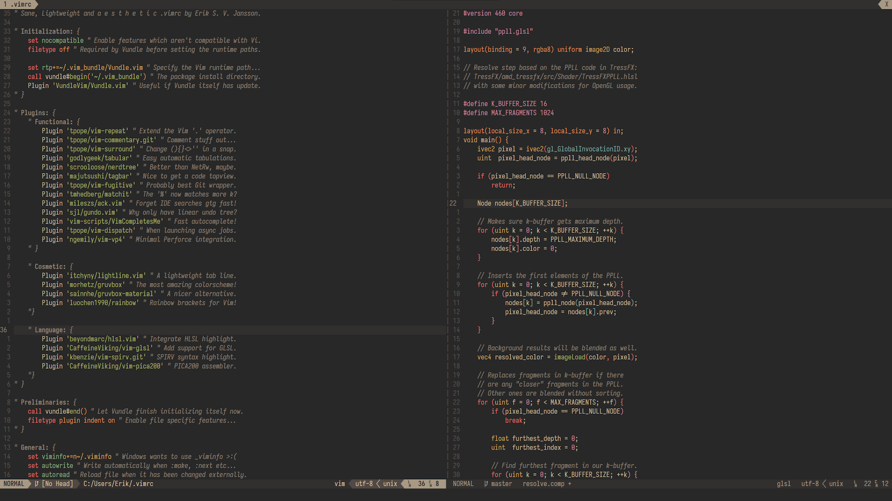

Sane, Lightweight, and Aesthetic Vim
====================================



Here is my personal Vim/NeoVim setup, which has been written (and documented) from the ground-up, tried-and-tested for several years by myself and several colleagues. It's built on the premise that regular Vim is awesome, and any additions in this configuration should be made to "enhance" the original Vim experience (not replace it). Therefore, you'll find that none of the bindings have been overwritten, and only a selected few packages have been included (and if you don't like some of them, feel free to remove them, which only requires a couple of lines to be changed). More importantly, the configuration provides more sane defaults to Vim, just as in [tpope/vim-sensible](https://github.com/tpope/vim-sensible).

I hope you will find this Vim configuration useful. Please enjoy, and many happy hacking nights for you! If you think something should be changed, or if you've found a bug, please open a issue or a PR, and I'll take a look at it. I'm fairly happy with my current setup, but I am always open to considering small changes (especially if they can make my life easier as well!).

Installation
------------

The shell script snipplet below will download this repository to `~/.vim_temp` and then execute the setup script. This script creates all the necessary folders in your home folder and fetches the required Vundle package manager. Afterwards, the target `.vimrc` is moved there too (make sure you backup you existing configuration in case you don't like my configuration). Finally, it will automatically open vim and start downloading the required packages for you (go fetch some coffee or maybe fika).

```sh
git clone https://github.com/CaffeineViking/vimrc.git ~/.vim_temp && \
cd ~/.vim_temp && ./setup.sh && rm -rf ~/.vim_temp && cd ~
```

If the script doesn't work (maybe you are running Windows or MacOS) you can just follow the steps below:

1. Remove (backup) your existing .vimrc and related folders from your home directory.
2. Download this repository, just copy over the .vimrc to your home directory.
3. Create two folders, `.vim_bundle` and `.vim_undoes` in your home directory.
4. Fetch the source from the Vundle repository. Put it in `.vim_bundle/Vundle.vim`.
5. Probably install the `Hack` font too, which has support for powerline.
6. Run vim and call `:PluginInstall`.
7. Done! Please enjoy.

Features
--------

* [Vundle](http://github.com/VundleVim/vundle): an awesome package manager.
* [NERDTree](https://github.com/scrooloose/nerdtree): fast filesystem browser, see everything!
* [TagBar](https://github.com/majutsushi/tagbar): painless navigation of tags (functions, classes etc...).
* [Fugitive](https://github.com/tpope/vim-fugitive): easily one of the best Git integrators for Vim.
* [Vim-Surround](https://github.com/tpope/vim-surround): enables one to manipulate e.g. (){}<> directly.
* [GUndo](https://github.com/sjl/gundo.vim): graphical visualization of the Vim undo tree and diffs for them.
* [VimCompletesMe](https://github.com/ajh17/VimCompletesMe): simple and lightweight built-in auto-completions.
* [LightLine](https://github.com/itchyny/lightline.vim): minimal and lightweight statusline/tabline.
* [Tabular](https://github.com/godlygeek/tabular): automatically tabulates (boring) stuff for you.
* [Vim-Repeat](https://github.com/tpope/vim-repeat): extends vim's '.' operator usage.
* [Vim-Commentary](https://github.com/tpope/vim-commentary): comment stuff out with gc.
* [MatchIt](https://github.com/tmhedberg/matchit): operator '%' matches more stuff.
* [Ack](https://github.com/mileszs/ack.vim): searches directory absurdingly fast.
* [GruvBox](https://github.com/morhetz/gruvbox): very, extremely, pretty colors.
* No overwritten vim bindings, all key mappings are bound to the leader key.
* Sane defaults for vim: indents, no swap files, persistent undo tree etc...

Bindings
--------

* Global leader key: `<space>`
* Disable Highlight: `<ctrl>l`
* Tabulate it baby!: `<leader>a`
* Opens Ack search: `<leader>f`
* Toggle NERDTree: `<leader>d`
* Toggle TagBar: `<leader>s`
* Toggle GUndo: `<leader>g`
* Run "Make": `m<return>`
